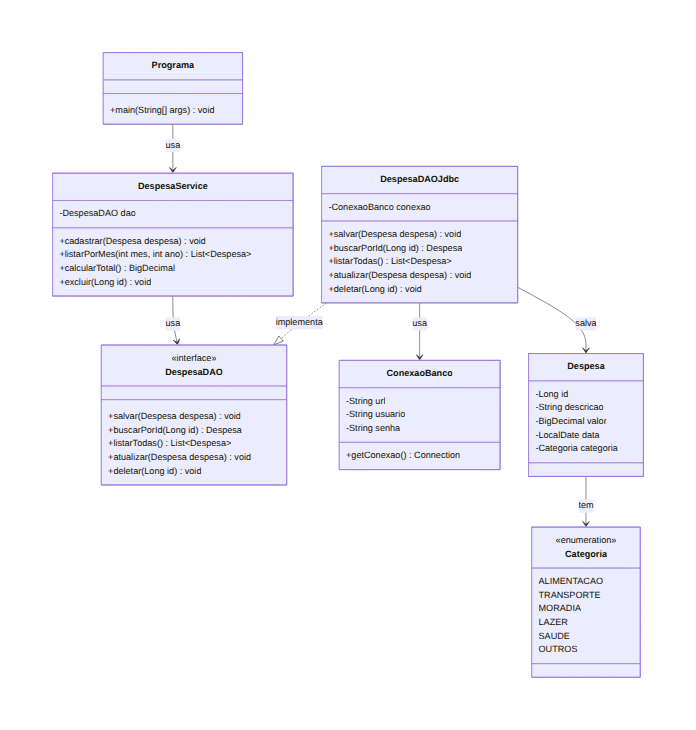
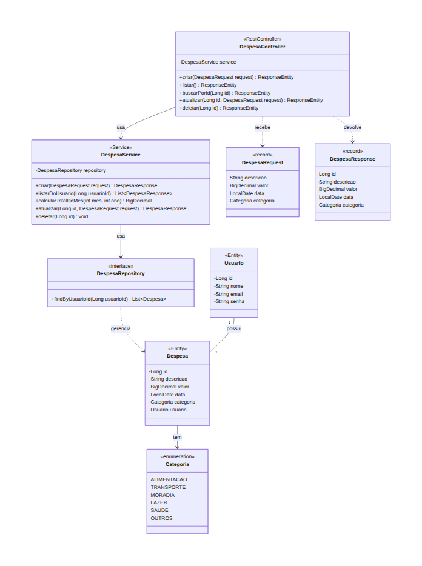

# Expense Tracker Java

Personal expense tracker built in Java, planned to evolve from a console application to a Spring Boot REST API.

> 🚧 Project in development. This repository documents the plan and the progress of my studies.

## Roadmap

- [ ] Version 1: Console application (pure Java, OOP and Collections)
- [ ] Version 2: Database persistence (PostgreSQL + JDBC)
- [ ] Version 3: REST API (Spring Boot, JPA, Security with JWT)

## Class Diagrams

### Version 1: Console

### Version 2: Database (JDBC)

### Version 3: Spring Boot REST API

## Author

Gxstein