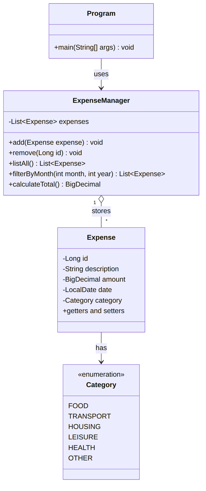
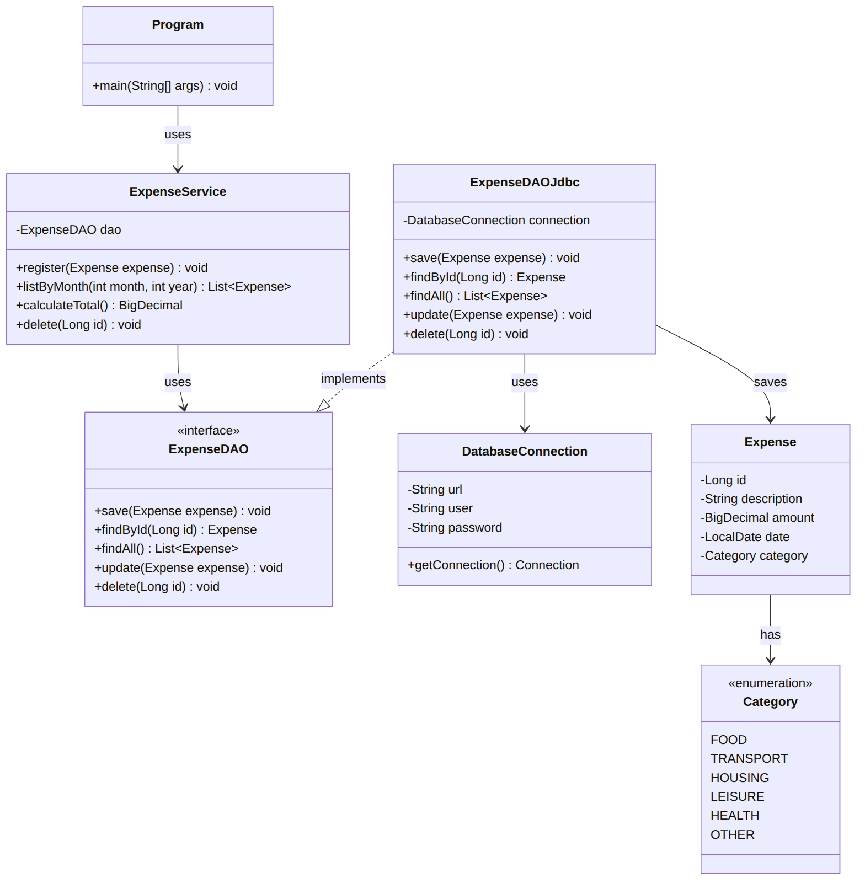
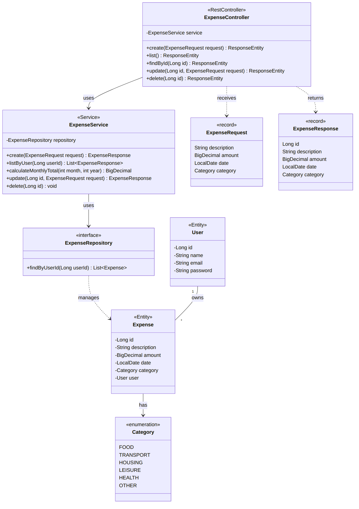

# Expense Tracker Java

Personal expense tracker built in Java, planned to evolve from a console application to a Spring Boot REST API.

> 🚧 Project in development. This repository documents the plan and the progress of my studies.

🇧🇷 [Versão em português](docs/pt-br/README.md)

## Roadmap

- [x] Version 0: Procedural console version (loops, conditionals, Scanner)
- [x] Version 1: Console application (pure Java, OOP and Collections)
- [ ] Version 2: Database persistence (PostgreSQL + JDBC)
- [ ] Version 3: REST API (Spring Boot, JPA, Security with JWT)

## Class Diagrams

Diagram sources (Mermaid) are in [`docs/diagrams/src`](docs/diagrams/src).

### Version 1: Console

### Version 2: Database (JDBC)

### Version 3: Spring Boot REST API

## Author

[Gxstein](https://github.com/Gxstein)
