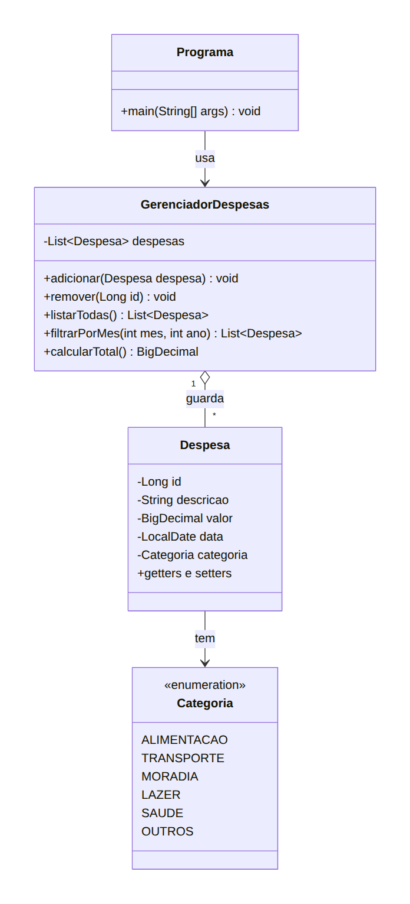

# Expense Tracker Java (português)

Sistema de controle de despesas pessoais em Java, planejado para evoluir de uma aplicação de console até uma API REST com Spring Boot.

> 🚧 Projeto em desenvolvimento. Este repositório documenta o plano e o progresso dos meus estudos.

🇺🇸 [English version](../../README.md)

> O código do projeto é escrito em inglês. Esta pasta é só a documentação em português, com os diagramas originais que usei para planejar.

## Roadmap

- [x] Versão 0: console procedural (laços, condicionais, Scanner)
- [ ] Versão 1: console com POO e Collections (Java puro)
- [ ] Versão 2: persistência em banco (PostgreSQL + JDBC)
- [ ] Versão 3: API REST (Spring Boot, JPA, Security com JWT)

## Glossário (português → código)

| Português | Código |
|---|---|
| Despesa | `Expense` |
| Categoria | `Category` |
| GerenciadorDespesas | `ExpenseManager` |
| descricao / valor / data | `description` / `amount` / `date` |
| ALIMENTACAO, TRANSPORTE, MORADIA, LAZER, SAUDE, OUTROS | `FOOD`, `TRANSPORT`, `HOUSING`, `LEISURE`, `HEALTH`, `OTHER` |

## Diagramas de classes

### Versão 1: Console

### Versão 2: Banco de dados (JDBC)

### Versão 3: API REST com Spring Boot

